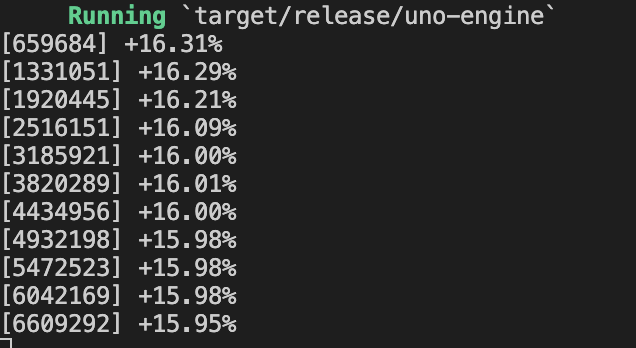

Simulates hundreds of thousands of games of uno and forces different algorithms to compete with each other.
Stacking +2 and +4's are allowed

Image below shows the increase in likelihood of you winning compared to your base rate (`1 / player_count`) as compared to a strategy of just choosing the first valid move where
- Always use +4 when the next player has 1 card left.
- Save +4 unless the player is close to winning
- Choose most common color in your hand for Wild and +4

